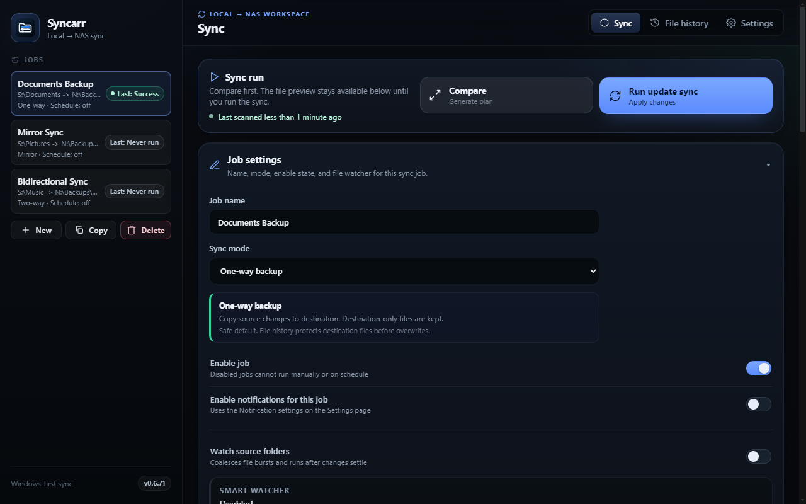
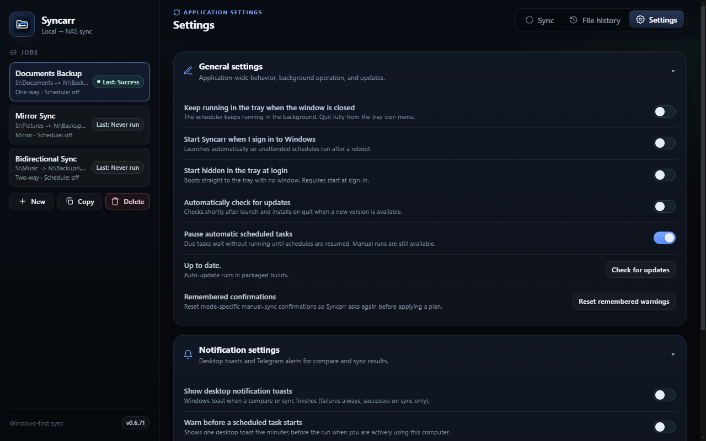
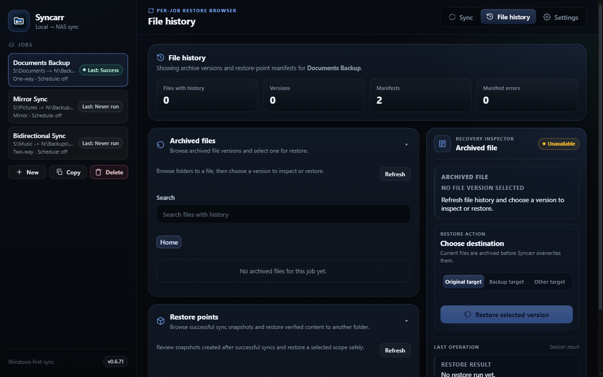
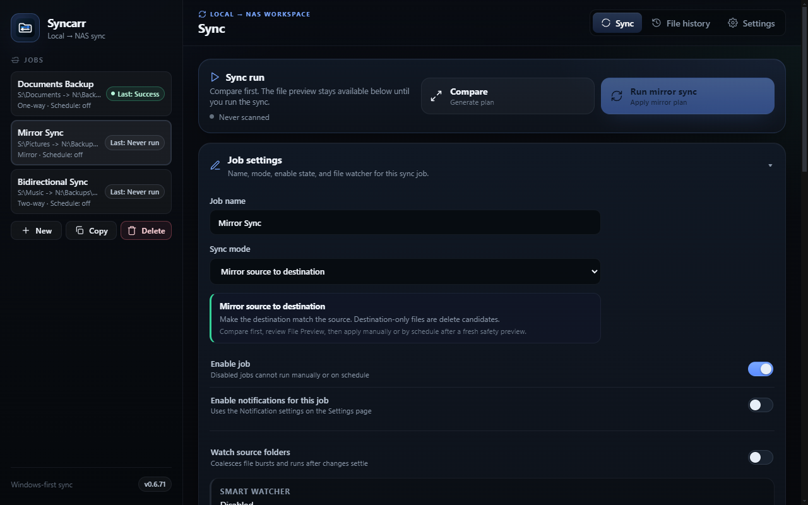
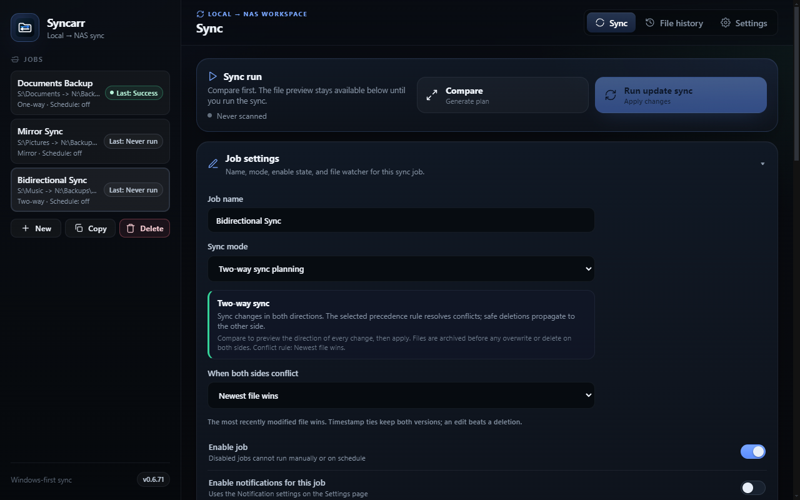

<div align="center">


# Syncarr

**Safe, scheduled file synchronization for Windows, macOS, and Linux**

[](https://opensource.org/licenses/MIT)
[](https://github.com/MrBeanTheOne/syncarr)
[](https://github.com/MrBeanTheOne/syncarr)
[](https://github.com/MrBeanTheOne/syncarr)

</div>

---

## Overview

Syncarr automates folder synchronization between your local machine and a NAS (Network Attached Storage) share. It combines the speed and reliability of platform-specific sync engines (robocopy on Windows, rsync on Unix) with intelligent scheduling, history tracking, and restore points to keep your data safe.

---

## Table of Contents

- [Features](#features)
- [Screenshots](#screenshots)
- [Installation](#installation)
- [Quick Start](#quick-start)
- [Architecture](#architecture)
- [Testing](#testing)
- [License](#license)

---

## Features

- **Scheduled Syncing** — Automatically sync folders on a schedule (repeating interval, daily, weekly, or at app startup)
- **Multiple Sync Modes** — Choose between one-way copy, mirror (with deletions), or bidirectional two-way sync with conflict resolution
- **Restore Points** — Automatic snapshots before each sync run; browse and restore previous versions easily
- **Run History** — Complete audit trail of all sync operations with detailed logs and file-level changes
- **Platform-Optimized Engines**
  - Windows: robocopy for speed and reliability
  - macOS/Linux: rsync with full feature support
- **Background Scheduling** — Runs in the system tray; syncs continue even when the app window is closed
- **Safe by Default** — Dry-run preview before any sync, detailed change reports, automatic crash recovery
- **Flexible Exclude Patterns** — Glob-style patterns to skip files and folders (`.git`, `node_modules`, etc.)
- **Free Space Protection** — Configurable minimum free disk space check before sync
- **Retention & Cleanup** — Optional automatic cleanup of old versions after configurable aging policies

---

## Screenshots

### Main Sync View
The primary interface shows your configured sync jobs, with quick access to compare and run options. Select a job to preview its source/destination paths and adjust sync settings.



### Settings Panel
Configure global preferences: background scheduling, notifications, update checks, and "start at login" behavior.



### File History & Restore Points
Browse the complete history of all synced files across versions. Restore individual files or entire snapshots from previous runs.



### Mirror Sync
Switch between sync modes (one-way copy, mirror with deletions, bidirectional) to match your workflow. Each mode shows relevant settings and conflict policies.



### Two-Way Synchronization
Bidirectional sync keeps both source and destination in sync, with conflict resolution based on your chosen policy (newest-wins, source-priority, destination-priority, or keep-both).



---

## Installation

### From Release

1. Download the latest installer from [Releases](https://github.com/MrBeanTheOne/syncarr/releases)
2. Run the installer and follow the setup wizard
3. Add your sync jobs and start scheduling

### Development Build

```bash
git clone https://github.com/MrBeanTheOne/syncarr.git
cd syncarr
npm install
npm run dev
```

To build an installer:

```bash
npm run pack:win    # Portable executable (Windows)
npm run dist:win    # NSIS installer (Windows)
npm run dist:mac    # DMG + ZIP (macOS)
npm run dist:linux  # AppImage + DEB (Linux)
```

---

## Quick Start

### 1. Create a Sync Job

- Open Syncarr
- Click "New Job"
- Select a local folder (source) and NAS target (destination)
- Configure exclude patterns if needed (optional)

### 2. Choose a Sync Mode

- **One-way**: Copy files from source to destination only
- **Mirror**: Copy and delete, keeping destination an exact mirror
- **Two-way**: Bidirectional sync with conflict resolution

### 3. Preview Changes

- Click "Compare" to see a dry-run of what will be synced
- Review the change report to ensure correctness

### 4. Schedule or Run

- Run immediately, or
- Set a schedule (repeating interval, daily, weekly, or at app startup)
- Jobs run in the background even when the app is minimized to the tray

### 5. Monitor & Restore

- View run history and detailed logs
- Restore previous versions from restore points if needed

---

## Architecture

Syncarr follows a three-layer Electron architecture:

- **Main Process** (Node.js) — Sync execution, scheduling, filesystem monitoring, durability recovery
- **Renderer Process** (Web-based UI) — User interface for job management, previews, history
- **Preload Bridge** — Secure IPC between renderer and main process

### Key Components

- **Sync Engines** — Pluggable robocopy (Windows) and rsync (Unix) backends with dry-run parsing
- **Two-Way Sync** — Per-job baseline snapshots with append-only event logs for durability
- **Scheduler** — Background scheduler runs in main process (not renderer), continues when minimized
- **History** — Durable run journal and config store with automatic backup and crash recovery
- **Platform Abstraction** — Unified interface for Windows, macOS, and Linux specifics

For detailed architecture documentation, see [Architecture](docs/ARCHITECTURE.md) (if available).

---

## Testing

```bash
npm test
```

Runs the test suite using Node's native test runner. Tests use factories for dependency injection and verify both unit behavior and integration scenarios.

---

## License

MIT — see [LICENSE](LICENSE) for details.

---

**Built by** [Retile](https://github.com/MrBeanTheOne) | **GitHub**: [MrBeanTheOne/syncarr](https://github.com/MrBeanTheOne/syncarr)
